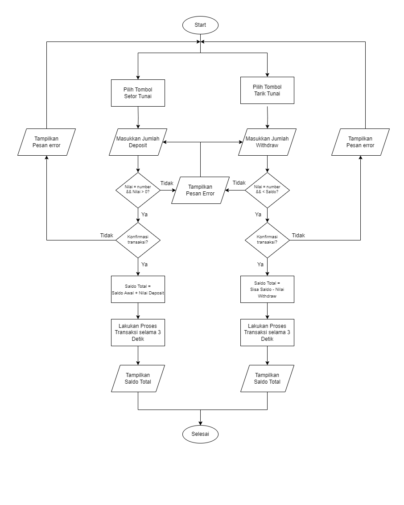

# Basic Banking System

This repository contains the results of challenge 2 work on the Backend Engineering Fresh Graduate Academy (FGA) program with Binar Academy partners.

# Skill Metrics

- [x] Programming Algorithm 
- [x] Perform error handling 
- [x] Implement Asynchronous process 
- [x] Implement OOP 
- [x] Using Git

# Delivery

1. Create a new repository on GitHub named <kbd> "Basic-Banking-System" </kbd>
2. Copy the <kbd> bank_account.js </kbd> Challenge 1 file to the project directory in the new repository 
3. Create a new JavaScript file named <kbd> banking_system.js </kbd> Implement the BankAccount class with deposit() and withdraw() methods
4. Use setTimeout() to simulate an asynchronous transaction operation 
5. Commit and push changes to the GitHub repository

# Criteria

1. Using modular class OOP <kbd> 40 points </kbd>
2. Unravel the thought process using a flowchart <kbd> 30 points </kbd>
3. Use GitHub to manage repositories <kbd> 30 points </kbd>

# Study Case 

In this case study, we will create a simple Basic Banking System using **Object-Oriented Programming (OOP)** concepts and simulate asynchronous transaction operations.

# Flowchart

